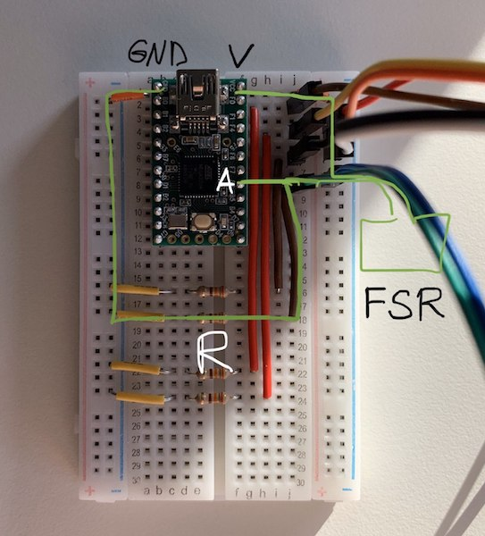

# Building a dance pad with FSR and Arduino

For dance gamers stuck at home and looking to bring an old pad back to life or build a new one. <3

## What are FSRs?
FSR stands for Force-Sensitive Resistor. It is a thin piece of conductive material used to recognize varying degrees of pressure. At rest the FSR's resistance is close to infinity, but it decreases when pressure is applied. As the resistance goes down, the voltage in the circuit goes up. Measuring the voltage indicates how much pressure is applied to the sensor.

## Why use FSRs for dance pads?
* Thin profile: they easily fit under the panels of both arcade and home pads, allowing to try them out with minimal modification to pad structure. They are also easy to incorporate into a home-made pad.
* Precise performance: with good firmware, FSR pads perform as good as well-modded pads with arcade sensors.
* Variable sensitivity: each sensor's threshold can be adjusted individually, without touching the pads. Each player can store their own sensitivity profile.
* Decoupling pad feel from sensitivity: raising or lowering the panels no longer affects sensitivity, making it possible to adjust these qualities separately.

## How to make it work
### Materials
You will need:
* An Arduino that can communicate via USB. You probably want something that uses an ATmega32U4 controller, for example an Arduino Leonardo, an Arduino Micro, or a Teensy 2. Ensure that your board has enough analog pins to accommodate the number of sensors you wish to connect. You may want to order one with pre-soldered pins.
* FSRs, at least one per panel. They come in different shapes and withstand different pressures. I use FSR406 or FSR402.
* Resistors. They prevent the FSR from short-circuiting. Experiment with resistance values to get a good sensitivity range, which will depend on the type of FSR. I use 330 Ohm.
* Wires, to connect the FSRs and the board. If in doubt, search for "jumper wire" and get a variety of connectors (F-F, M-M, M-F). They can be chained together to make a longer wire.
* A breadboard to prototype the circuit. The breadboard can stay forever in the control box if you don't feel like soldering anything.
* Tape to fix the FSRs to the pad, and to create a pressure point. You may also need electrical tape to isolate the wires from the pad.
* (optional) Clincher connectors to secure the wire to the FSRs. The wires will be less likely to fall off during the session, though mine were taped together and did pretty well for a while.

### Assembling the circuit
Below is a board with 4 sensors attached. Highlighted is part of the circuit serving one sensor. The pins on your Arduino will differ, refer to the manual to find the right ones. Position of wires on the breadboard matters! If you are unsure how a breadboard works, read this [intro guide](https://learn.sparkfun.com/tutorials/how-to-use-a-breadboard/all).

Points of interest:
* V — the voltage pin on the board.
* A — an analog pin which measures voltage.
* FSR — the FSR is connected with two wires, off-picture.
* R — the pulldown resistor that prevents short-circuiting.
* GND — the ground pin on the board.

If you wish to connect more than one FSR per panel, connect them in parallel to the same resistor and pin. Pressing any of the FSRs will trigger the panel. You may also connect them to separate pins, and bind the pins to one button.

### Firmware and software

To interpret voltage readings, you will need to program your board with an Arduino sketch. At a minimum, the sketch should read voltage on the pins, and determine whether or not it is higher than a certain threshold. When it is, the board should send a keystroke or a joystick button press. A more advanced sketch would also linearize the voltage and handle double-triggering.

While you don't necessarily need any software to use the board, it is helpful to at least output sensor readings to the command line for debugging. It could also be helpful to have an interface to change sensor thresholds and reload the sketch to the board.

Here are two existing FSR dance pad repositories worth checking out:
* [mckyla-fsr](https://github.com/hippaheikki/mckyla-fsr) provides a sketch for a 4-sensor pad with normalization and anti-vibration, as well as a web interface to change sensitivity. It includes player profiles, which is great for multiple-user setups.
* [analog-dance-pad](https://github.com/kauhsa/analog-dance-pad) contains firmware specifically for Teensy 2, and a web application to configure sensitivity. Unlike the above, guarantees 1000Hz communication rate and allows to hotswap sensitivity values.

### Installing the sensors
Tape the sensors to the L-bracket or the frame in your pad, so that they are in contact with the panel. The sensor may not respond well if the pressure from the panel is distributed elsewhere. To fix this, put a few layers of tape size of a thumbnail onto the center of the sensor. The pressure will go into this area first, making the sensors a lot more sensitive. If your panels bend a lot, like in Cobalt Flux-like home pads, reinforce the areas under the panels with some firm material, such as linoleum or tape. Nothing like good tape to fix a pad.

## Feedback
Questions, corrections, feedback? Holler at u/SereniRi!
